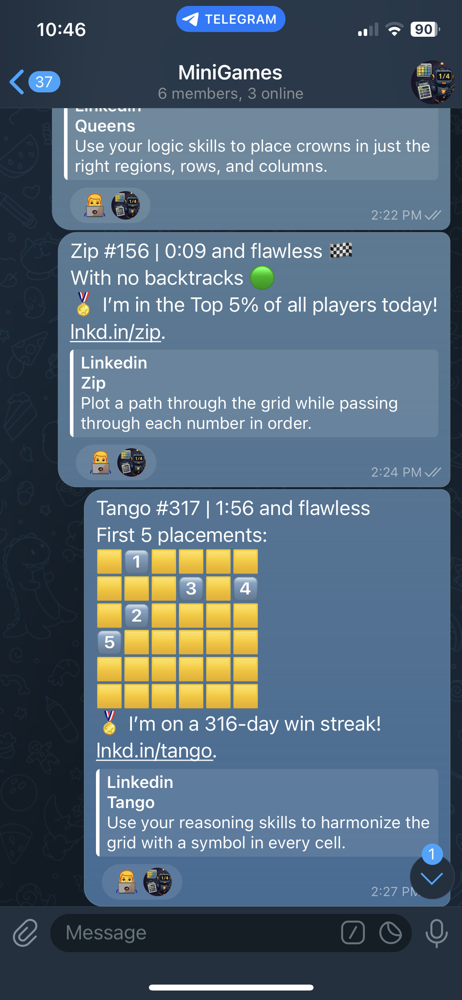
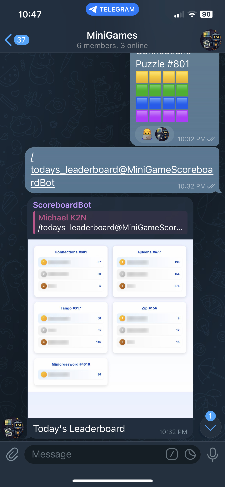

# 🏆 Scoreboard Bot

A Telegram bot that lets you **compare and share scores with friends** across multiple games and apps (like Wordle).  
Keep track, compete, and brag — all in one place!

---

## 🚀 Features
- Share daily scores from games like **Wordle** and others.
- Generate a **leaderboard image** for fun comparisons.
- Simple setup and lightweight design.
- Backed by a database for persistence.

---

## ⚙️ Setup Instructions

### 1. Create a Virtual Environment
We recommend using `pyenv`:

    pyenv install 3.13
    pyenv virtualenv 3.13 scoreboardbot
    pyenv activate scoreboardbot

### 2. Install Dependencies

    pip install -r requirements.txt

### 3. Configure Image Generation (Optional but Recommended)
Scoreboard images are generated using [browserless](https://www.browserless.io/).  
Spin up a local Docker container:

    docker run -p 3000:3000 ghcr.io/browserless/chromium

### 4. Get a Telegram API Key
1. Open Telegram and chat with [@BotFather](https://t.me/BotFather).
2. Run `/newbot` and follow the prompts.
3. Copy the generated **API Token**.

### 5. Add Your Secrets
Copy the example file and fill in your details:

    cp secret_example.py secret.py

Update `secret.py` with your **Telegram API key** and other required values.

---

## 🗄 Database & Migrations
This project uses **Tortoise ORM** with **Aerich** for migrations.

- Initialize database:

      aerich init-db

- Create new migration:

      aerich migrate

- Apply migrations:

      aerich upgrade

---

## 📥 Example Input

Notice the bot reacts to messages it understands with a "👨‍💻" emoji.

## 🏆 Example Scoreboard

---

## 🤝 Contributing
Pull requests are welcome! If you’d like to contribute:
- Fork the repo
- Create a feature branch
- Submit a PR 🚀

---

## 📜 License
MIT License. See [LICENSE](LICENSE) for details.
